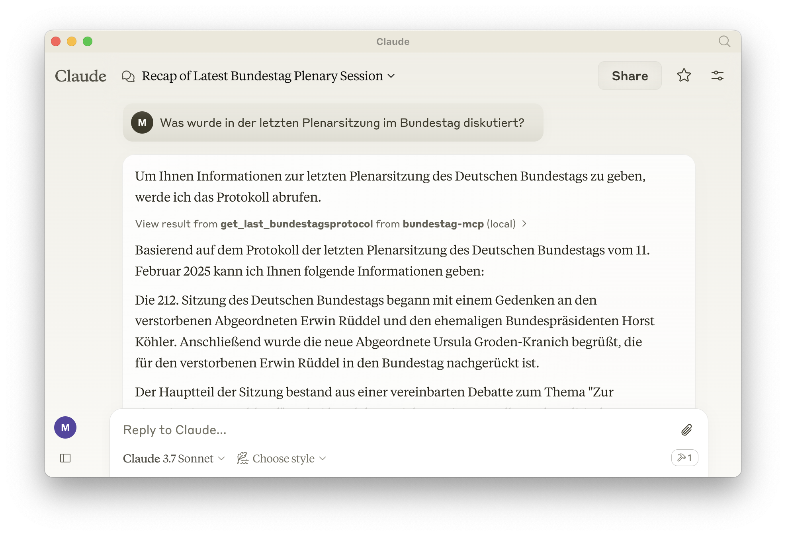

# Bundestag MCP

This is a simple [MCP server](https://modelcontextprotocol.io/) which gives access to the [protocols](https://dip.bundestag.de/) of the German parliament. Once installed you can "chat with the parliament":



This MCP server needs to be installed with a Chat client. We'll use [Claude Desktop](https://claude.ai/download) as an example.

## Installation Options

### Option 1: Using a Container

```sh
# Clone this repo
git clone git@github.com:luebken/bundestag-mcp.git; cd bundestag-mcp

# Build the container image
podman build -t bundestag-mcp .

# Run the container with your API key
podman run -e BUNDESTAG_API_KEY=your_api_key bundestag-mcp
```

Alternativ können Sie den Container auch in Claude Desktop einbinden:

```json
{
  "mcpServers": {
    "bundestag-mcp": {
      "command": "podman",
      "args": ["run", "--rm", "-e", "BUNDESTAG_API_KEY=your_api_key", "bundestag-mcp"]
    }
  }
}
```

### Option 2: Local Installation

```sh
# Clone this repo
git clone git@github.com:luebken/bundestag-mcp.git; cd bundestag-mcp

# Install python dependencies
uv venv
source .venv/bin/activate
uv pip install -e .

# Configure bundestag-mcp for Claude > Settings > Developer > Edit Config
# /Users/YOUR_USERNAME/Library/Application Support/Claude/claude_desktop_config.json
{
  "mcpServers": {
      "bundestag-mcp": {
          "command": "uv",
          "args": [
              "--directory",
              "/ABSOLUTE/PATH/TO/PARENT/FOLDER/bundestag-mcp/",
              "run",
              "server.py"
          ]
      }
  }
}
# Restart Claude. 
# Test with the prompt
# > Was wurde in der letzten Plenarsitzung im Bundestag diskutiert?
```

## Debug

```sh
npx @modelcontextprotocol/inspector uv --directory $(PWD) run server.py
```

## Roadmap

- [x] Last protocol
- [ ] Error handling
- [ ] Logging <https://modelcontextprotocol.io/docs/tools/debugging#server-side-logging>
- [ ] Protocol for a specific date / number
- [ ] Protocols for a date range
- [ ] Support [MCP SSE](https://modelcontextprotocol.io/docs/concepts/transports#server-sent-events-sse)
- [ ] Other API endpoints: Vorgänge, Drucksachen, Aktivitäten
- [ ] Keyword / Similiarity Search

## Resources

- <https://dip.bundestag.de/%C3%BCber-dip/hilfe/api>
